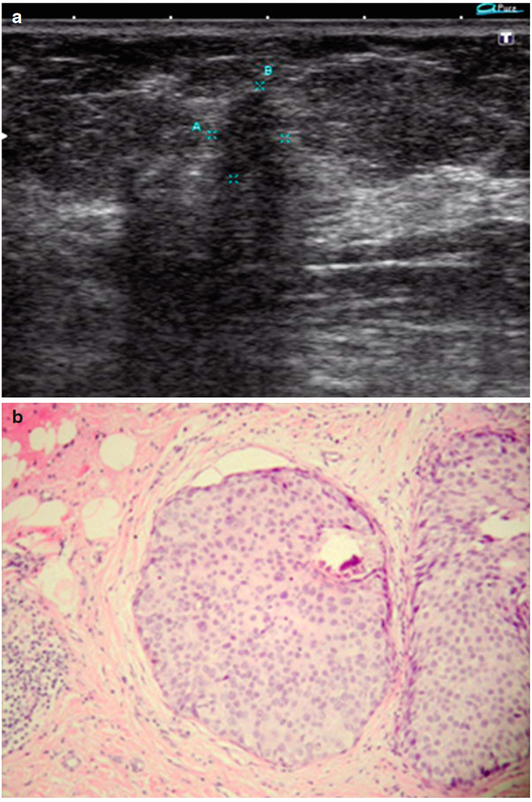

# 第六章 不同类型乳腺癌的超声特征

我们自己的研究显示，在所有乳腺癌的组织学类型中，**浸润性导管癌（59%）**是最常见的。还有几种其他类型的乳腺癌发生率较低，包括**浸润性小叶癌（8%）、小管癌（7%）、囊肿内癌（5%）、黏液癌（4%）、髓质癌（4%）和其他类型（13%）**。我们试图通过超声图像来推断肿瘤的形态结构。然而，尽管使用了CDI、PDI、3D和其他选项来增强超声图像，但往往无法区分乳腺癌的形态类型。**识别病变形态结构的困难也是因为三分之一的乳腺癌（31.5%）是混合型肿瘤。**浸润性导管癌表现出一组特征，可与良性病变进行可靠的鉴别诊断，从而将其与其他恶性肿瘤区分开来。

## 以下是乳腺导管癌的超声特征（图6.1）：

- 回声密度减低
- 回声结构均匀
- **边界不清晰、粗糙**
- 周围组织回声密度增高
- 后方声影
- CDI、PDI和3DPD中的A-或低血管性
- PW多普勒中病变内血流的高PI和RI
- 强烈的超声弹性成像染色
- 浸润性导管癌是一个**实心的密度高的病变，呈椭圆形或斑点状**，对应于优势为间质纤维化的腺癌（图6.1b和c）。

图6.1 一例浸润性导管乳腺癌。（a）1-2. 灰度超声图像。（b）肉眼观察图。（c）用H&E染色的浸润性导管癌切片；原始放大倍率为×100。

## 原位小叶癌（泡状癌、腺泡癌、非浸润性小叶癌）

是一种乳腺癌类型，最初呈现为上皮中清晰界定的一群恶性细胞，不涉及基底膜，但具有潜在侵袭性。**通常不表现临床症状、乳房X线摄影特征或超声特征。**它是乳房活检中对结节性乳腺病的偶然发现（图6.2）。

图6.2. 原位小叶癌。（a）灰度超声图像。（b）原位小叶癌切片的H&E染色图像；原始放大倍率为×100。

## 侵袭性小叶癌

占所有乳腺癌的5-15％。它以密集的结节和不清晰的边界为特征。它呈现出坚硬的生长和器官内扩散，并且通常是双侧性的。它表现出以下超声特征（图6.3）：

- **焦点病变**
- 不规则形状
- 低回声模式
- 不均匀结构
- 小叶状边界
- 不清晰的轮廓，不规则的边界
- 在CDI、PDI和3DPD中呈A-或低血管性
- 强烈的超声弹性成像染色

图6.3 侵袭性小叶乳腺癌。（a）灰度超声图像。（b）侵袭性小叶癌切片的H&E染色图像；原始放大倍率为×100。

## 具有硬性纤维化优势的乳腺癌

呈现为以下超声特征（图6.4）：

- 低回声病变
- 不均匀的回声结构
- 不规则形状
- 小叶状、粗糙的边界
- 不清晰的轮廓
- 在CDI、PDI和3DPD中呈A-或低血管性
- 强烈的超声弹性成像染色

图6.4 硬癌乳腺癌。（a）灰度超声图像。（b）硬癌乳腺癌切片的H&E染色图像；原始放大倍率为×100。

在宏观上呈现出**密集的结节，边界不清晰，常常是双侧的，表现出硬癌生长和器官内扩散**。这种类型的癌症在X线阴性肿瘤中占主导地位；因此，超声在其诊断中具有优势。

根据Marquet等人的研究（1995年），硬癌乳腺病变更常被成像为具有不清晰轮廓的病变。这是侵袭性生长的结果，其星状推测形状是由结缔组织引起的。根据Ueno（1996年）和Mihaylov和Skrynnik（1997年）的研究，后方阴影表明肿瘤结构中存在显著的结缔组织成分。乳腺肉瘤占所有恶性乳腺病变的0.2-4.0％（Rozhkova 1993; Korzhenkova 2004），并且可以**在各个年龄段观察到**。

## 乳腺肉瘤

特征性超声特征（图6.5）如下：

- 低回声病变
- **具有回声不均匀和质地各异的无回声包含物**
- 光滑的不清晰边界
- **较大的大小（更常见）**
- 在CDI、PDI和3DPD中呈高血管性或低血管性
- 在超声弹性成像中呈强烈、不规则（更常见的是“马赛克”状）染色
- 极少在腋窝淋巴结转移

图6.5 乳腺肉瘤。（a）灰度超声图像。（b）染有帕彭海姆染色的切片图像；原始放大倍率为×1,000。

## 黏液性乳腺癌

粘液癌（胶样、明胶状、黏液性肿瘤）是侵袭性导管癌的一种罕见亚型。它具有相对良好的预后。在宏观上，它呈现为灰色的良好局限乳腺病变，切开时呈现湿润的明胶状表面。显微镜下可见**单形细胞的实质性或黏液性复合物**，细胞质中含有黏液，在大量黏液凝块中间分布。

超声特征（图6.6）如下所示：

- 低回声病变
- **回声结构不均匀**
- 多环状粗糙边界
- 界限准确或不清晰
- 有时出现后方增强，更少见的是声影
- 在CDI、PDI和3DPD中呈A-或低血管性
- 在超声弹性成像中呈强烈、不规则的“马赛克”染色
- 极少在腋窝淋巴结转移

图6.6 黏液性乳腺癌。（a）灰度超声图像。（b）希尔氏染色的切片图像；原始放大倍率为×400。

## 髓样乳腺癌

通常表现为灰色的、质地柔软、结构不纯的准确局限结节，其超声特征如下所示（图6.7）：

- **圆形状**
- 回声密度降低
- 回声结构不均匀，常见有无回声包含物
- 准确的轮廓
- 不规则的边界
- 在CDI、PDI和3DPD中呈A-或低血管模式
- 超声弹性成像中染色降低、不规则的“马赛克”染色

管状乳腺癌是一种罕见的癌症类型。由于其较为良好的临床进展和预后，它被从浸润性导管癌中分离出来。它最常见于年长的人群。显微镜下可见稍微呈角状、延长形状的单层管状结构。间质以明显的纤维化和玻璃样变性为特征。常见到导管周围和血管周围弹力纤维增生的灶点。

图6.7 髓样乳腺癌。（a）灰度超声图像。（b）染有帕彭海姆染色的切片图像；原始放大倍率为×1,000。

## 管状乳腺癌

通过以下方式通常可以超声诊断管状乳腺癌（图6.8）：

- 混合回声密度的病变
- 不规则的结构
- 边界平整或粗糙
- 轮廓不清晰
- 常伴有后方声影
- 在CDI、PDI和3DPD中呈A-或低血管模式
- 超声弹性成像中呈强烈、不规则的硬性染色

图6.8 管状乳腺癌。（a）灰度超声图像。（b）希尔氏染色的切片图像；原始放大倍率为×100。

## 总结

根据Trofimova（2002）和Zabolotskaya（2006）的研究，**超声特征不能真正地表征乳腺癌。大多数特征只能与其他指标和不同方法的数据相结合考虑（Sencha等，2009）**。常规和新的超声技术可以帮助鉴别恶性病变的特征，以便在大多数复杂的诊断情况下进行鉴别诊断。

所有可用的超声技术有助于将患者分为以下几组：

- 乳房正常的患者，不需要进一步详细检查或随访。他们应每1-2年接受一次乳房检查。
- 乳房病变患者，不需要手术治疗。他们需要每6-12个月进行乳房检查随访。
- 怀疑恶性的乳房肿块患者。需要进一步检查（如乳房活检）。可能需要后续手术治疗。

医生的高水平资质和合作、遵循诊断过程连续性的原则，以及利用所有可用的技术，能够合理规划诊断和医疗策略，提高乳腺肿瘤的诊断水平并显著提高治疗效果。

以下是乳腺癌患者超声报告的示例：

日期：
姓名：B.
年龄：52岁
上次月经的第一天：
乳房主要由脂肪组织组成。腺体组织厚度为11毫米。纤维组织在各个象限中适度表达。右侧乳房内的乳导管适度扩张，最大直径为0.4厘米，主要位于外象限。右侧乳房的上外象限（10点钟位置）有一个大小为2.3×3.1厘米，形状不规则的均质低回声病变，边界模糊、粗糙。该病变在CDI、PDI和3DPD中呈低血管模式（中央区域有3个彩色像素）。超声弹性成像显示强烈的不规则硬性（蓝色）染色。右侧腋窝淋巴结增大，大小为1.0-2.2厘米，低回声，结构不规则，血流模式紊乱。其他区域的淋巴结未增大。

结论：右侧乳房病变可疑为癌症。右侧腋窝淋巴结存在转移的超声征象。建议对病变和右侧腋窝淋巴结进行活检。
