# 第七章 乳腺疾病的鉴别诊断

在育龄妇女中，乳腺疾病的发病率为10%-65%（Zabolotskaya等，2002）。所有乳腺变化可以分为两个基本类别：肿瘤性和非肿瘤性过程。乳腺疾病的诊断应始终涉及肿瘤学的关注。乳腺癌与良性局灶性和弥漫性乳腺变化的大类别进行区分。良性乳腺变化最常见。它们具有各种临床、形态和病因特征的异常。存在几种分类方法。例如，自1985年以来，俄罗斯在实际应用中使用以下分类：

I. 弥漫性乳腺增生

1. 以腺体成分为主（腺瘤病）
2. 以纤维成分为主
3. 以囊性成分为主
4. 混合型

II. 结节性乳腺增生

III. 良性肿瘤和瘤样过程

1. 腺瘤
2. 纤维腺瘤
3. 乳导管内乳头状瘤
4. 囊肿

IV. 特殊类型

1. 叶状肿瘤

## 7.1 良性病灶

纤维腺瘤是一种属于混合结缔组织和上皮肿瘤的良性乳腺肿瘤。它占据了所有良性乳腺病变的95%（Zabolotskaya，2006）。它呈现为一个边界清晰的结节，可以轻易推动到周围组织中。纤维腺瘤最常见于20-45岁的育龄妇女。病变的大小可以不同，但通常不超过3厘米。纤维腺瘤通常表现为单个结节，虽然在20%的病例中可能是多发性的，在10%的病例中可能是双侧性的（Korzhenkova，2004）。有时它会表现出快速增长，尤其是在青春期和流产后。随着年龄增长，纤维腺瘤往往会退缩，伴随着透明变性和基质钙化。

纤维腺瘤的恶性转化是一个不常见的特征（5%）。在这些情况下，局部原位小叶癌最常见（Sinyukova等，2007）。根据组织学结构的不同，纤维腺瘤可以有几种类型：管腔内型、管腔周围型、混合型和少年型。纤维腺瘤通常表现出以下超声特征（图7.1）：

- 固体乳腺病变，回声密度降低或正常
- 均匀的结构（少数情况下，异质性结构可能由于液体包容物、钙化或回声成纤维结构引起）
- 始终具有准确的轮廓
- 光滑或有叶状边界，取决于组织学类型
- 有时在后方回声增强
- 在压缩超声探头时可移动
- 在彩色多普勒超声（CDI）、脉冲多普勒超声（PDI）和三维彩色多普勒超声（3DPD）中呈A-或低血管化
- 在超声弹性成像中呈不规则的镶嵌染色

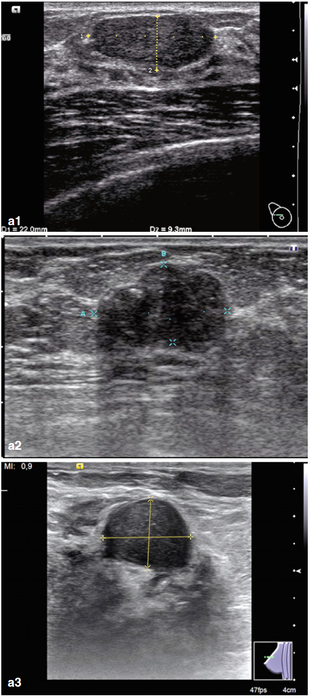

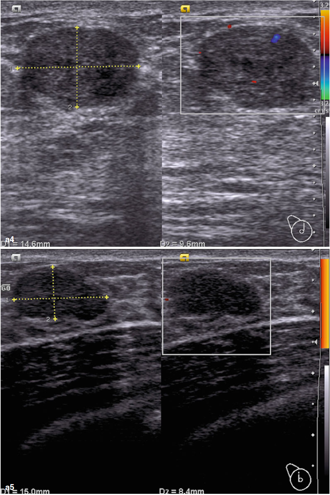

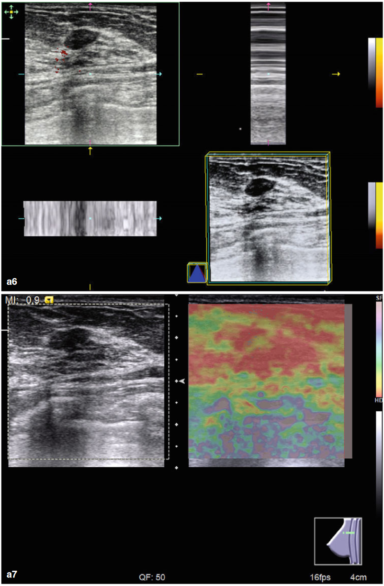

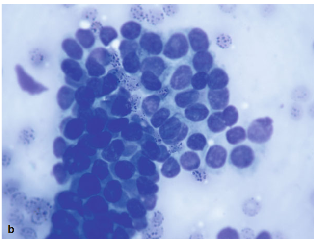

图7.1 乳腺纤维腺瘤。 (a) 1-7. 灰度超声、彩色多普勒超声（CDI）、脉冲多普勒超声（PDI）、三维彩色多普勒超声（3DPD）和压缩声弹性成像。 (b) 一张经过Pappenheim染色的切片图像；原始放大倍率为×1,000。

纤维腺瘤的超声特征因大小而异。直径小于1厘米的结节通常呈圆形状，结构均匀，回声密度降低，边界光滑或不规则。直径超过2厘米的纤维腺瘤更常呈规则的球形或卵形状，边界准确且光滑或不规则。周围组织通常不发生变化。良好勾画的孤立脂肪小叶可能会模仿纤维腺瘤。最重要的是区分纤维腺瘤和结节性乳腺癌的扩张性生长。根据Haylenko等人（2005）和Sinyukova等人（2007）的研究，超声通常无法检测到纤维腺瘤的血管，尤其是亚厘米级的结节。很少情况下，可以显示出1-2个具有低速度的正常血管：峰值收缩速度（PSV）为0.190.2m/s，舒张末速度（EDV）为0.06-0.1m/s，阻力指数（RI）为0.63-0.79，脉冲指数（PI）为1.21-1.65。Zabolotskaya和Zabolotsky（2000）报道了36%的纤维腺瘤在彩色多普勒超声（CDI）和脉冲多普勒超声（PDI）中显示高血管化。超声诊断乳腺纤维腺瘤的敏感性为89-91.2%，特异性为78-92.5%，诊断准确性为91-92.7%（Rahimzhanova等，2011年）。首次发现纤维腺瘤的患者应进行病变活检，包括细胞学（或组织学）检查，以确定肿瘤类型和腺上皮增生的程度。纤维腺瘤的增长、直径超过2厘米、腺上皮增生明显，尤其是有异型增生或不典型增生，是进行切除活检或切除手术的指征。叶状瘤是一种由结缔组织和上皮组织组成的乳腺混合性肿瘤。其发病率不超过所有乳腺病变的0.5-2%（Trufanov等，2009年）。叶状瘤可影响任何年龄的女性，并呈现出16-20岁和40-50岁的两个发病高峰。该肿瘤通常表现为孤立的病变。它可能长时间处于休眠状态，然后突然开始快速增长。怀孕可能会刺激其生长。由于叶状瘤的快速增大，通常在较大的情况下被诊断。临床上表现为边界清晰的叶状结构病变。巨大的肿瘤可以占据乳房的大部分区域，导致皮肤变薄，并激活皮下静脉模式。

下面列出了叶状瘤的特征超声表现（见图7.2）：

- 乳腺病变呈低回声或等回声
- 不规则的回声结构，多个无回声液体集合和内部包涵物（尤其在大病变中）
- 圆形状
- 清晰的轮廓，边界规则
- 常伴有对称的侧影和后方声增强
- 显著的结节内高血管化，可通过彩色多普勒超声（CDI）、脉冲多普勒超声（PDI）和三维彩色多普勒超声（3DPD）观察到
- 超声弹性成像显示不规则的镶嵌染色

叶状瘤可能表现出良性（60-70%）、恶性（25-30%）或中间特征（Trufanov等，2009年）。在结缔组织成分的恶性转化的情况下，它们可能发展成不同的肉瘤，如纤维肉瘤、脂肪肉瘤、软骨肉瘤、骨肉瘤或横纹肌肉瘤。结缔组织和上皮组分的恶性转化会导致肉瘤样癌。及早发现叶状瘤需要准确区分它与纤维腺瘤。与纤维腺瘤相比，叶状瘤具有更多细胞间质，具有复杂的结构，通常伴有更大程度的核多形性。生长类型可以通过对核心活检样本进行组织学检查来确定。

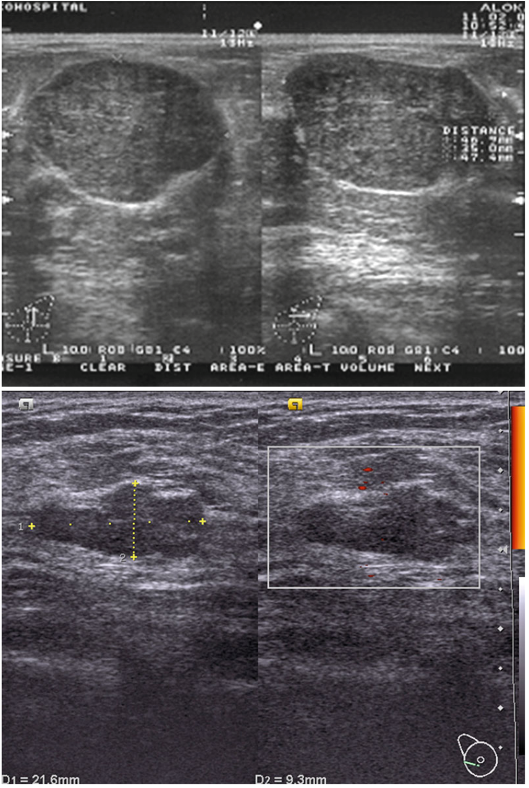

图7.2 叶状瘤。灰度超声和脉冲多普勒超声（PDI）。

脂肪瘤是一种源自脂肪组织的良性肿瘤，占所有乳腺病变的9%（Rozhkova，1993年）。真正的脂肪瘤由成熟的脂肪组织包围，并具有囊袋结构。在触诊时，它呈现为可移动的圆形或卵形软性病变，通常（但并非总是）能够与周围组织准确分隔开。

乳腺脂肪瘤的超声诊断通常不难。下面列出了乳腺脂肪瘤的特征超声表现（见图7.3）：

- 病变呈降低或正常回声密度，与正常脂肪乳房组织相当
- 有时由于纤维包含物而呈不规则结构
- 在压缩时容易变形
- 没有后方声增强或阴影
- 在彩色多普勒超声（CDI）、脉冲多普勒超声（PDI）和三维彩色多普勒超声（3DPD）中始终无血管显示
- 超声弹性成像显示规则的镶嵌染色

始终需要与脂肪肉瘤进行鉴别诊断。脂肪肉瘤生长迅速，回声密度相对降低，边缘疙瘩状，超声弹性成像和触诊时密度增加，并出现病理血管化。肿瘤活检可以确诊。

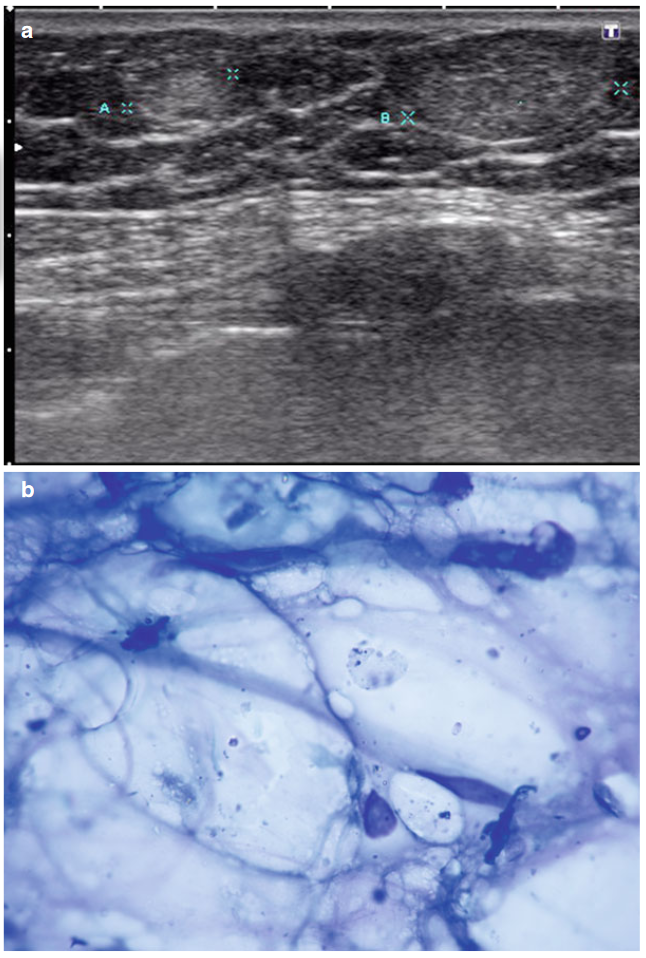

图7.3 乳腺脂肪瘤。 (a) 灰度超声图像。 (b) 一张经过Pappenheim染色的切片图像；原始放大倍率为×100。

乳管内乳头状瘤是一种生长在乳腺乳管腔内的病变（见图7.4）。可以出现单个或多个病变。乳管内乳头状瘤常伴有乳头异常分泌物。类似的分泌物较少出现在乳管扩张或纤维性乳房病变中。然而，13%的乳头出血和7%的浆液性分泌物是导致乳腺导管癌的结果。揭示乳管内肿块的一种基本方法是导管造影，即在进行X线乳腺摄影时，用含碘水溶性造影剂对乳管进行人工对比（见图1.3）。乳管内病变是进行乳腺手术的绝对指征。导管造影通常在常规乳腺摄影和乳头分泌物涂片细胞学检查之后进行。细胞学特征三联征，包括巨噬细胞、红细胞和乳头状结构或单独的腺上皮细胞，是乳管内乳头状瘤的典型特征。

然而，对于乳管炎症或乳腺癌患者，导管造影是禁忌的。这是为了避免在前一种情况下感染的扩散以及在后一种情况下癌细胞的扩散。超声在乳管内病变诊断中的价值受到一些因素的限制，例如设备的分辨率（传统扫描仪可以检测到大于2-3毫米的病变）以及乳管内病变的大小（肿瘤通常小于2毫米）。乳管内乳头状瘤可以导致乳腺乳头区域或乳房周边的乳管（乳管）孤立扩张。肿瘤本身看起来像一个实性乳头状病变，具有普通或增加的回声密度，边界呈分叶状，位于囊性腔内。

伴随细胞学上的非典型上皮增生的周围或末梢乳管的导管乳头状增生症（距离乳头超过3厘米）极有可能是导管癌。超声通常只在病变较大或乳管明显扩张的情况下能够区分乳管内乳头状瘤。

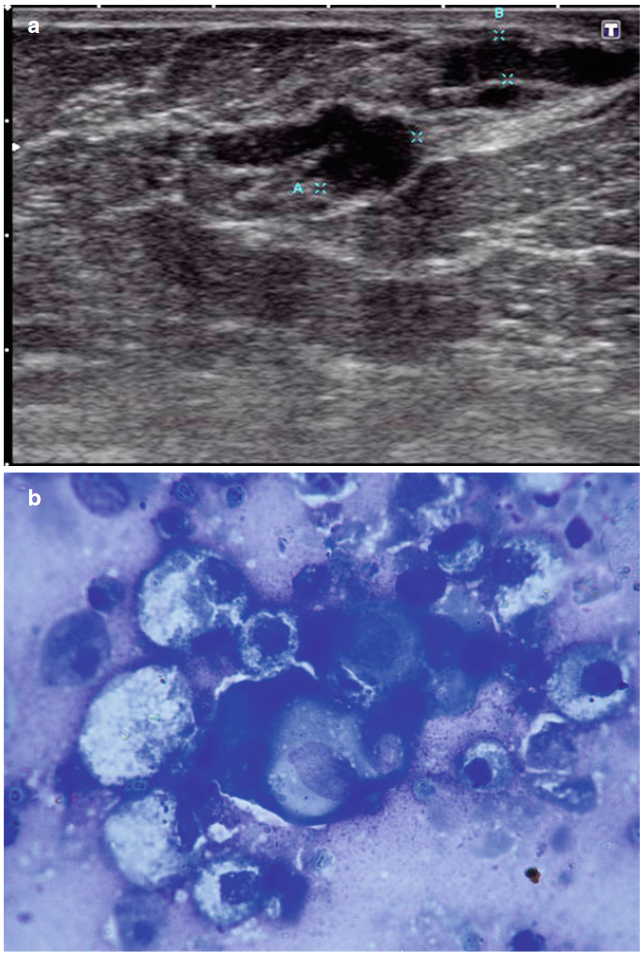

图7.4 乳管内乳头状瘤。 (a) 灰度超声图像。 (b) 一张经过Pappenheim染色的切片图像；原始放大倍率为×100。

## 7.2 非肿瘤性疾病

非肿瘤性乳腺病理学涉及不同病因和发病机制的病理过程。其中大约30%与导管和/或小叶上皮的增生有关（Trufanov等，2009）。乳腺炎是乳房中的一种炎症非特异性过程。它分为哺乳期（约占90%）和非哺乳期类型。炎症过程可以是急性或慢性的。急性乳腺炎表现为以下发展阶段：浆液性炎症、浸润和脓肿。乳腺炎具有以下超声特征（图7.5）：

- 炎症区域皮肤增厚（超过健康区域和对侧乳房）
- 皮下脂肪回声密度增加
- 深层真皮与相邻结构（脂肪或腺体组织）之间的边界不清晰
- 乳腺实质结构的不清晰分化
- 乳腺实质内一到多个低回声区域，边界明确或模糊
- 突出的结缔组织成分
- 乳腺实质囊性腔和/或乳管扩张
- 乳腺实质的血管呈规则分布，CDI或PDI显示血管直径均匀减小
- 腋窝淋巴结肿大

超声特征的表现直接取决于临床症状。在某些情况下，如治疗迟缓或不充分，炎症从浆液性浸润发展为弥漫性化脓阶段，伴有乳腺实质的化脓性小灶，这些小灶聚集形成脓肿。乳腺脓肿可根据其位置分为皮下、乳晕下、乳腺内和乳腺后。在大多数情况下，感染通过乳头、乳晕或乳管上皮的受损皮肤进入乳腺组织。然而，感染也可能由于免疫反应较弱而引起血源性或淋巴源性污染。了解急性乳腺炎的临床表现对于与浸润型乳腺癌进行鉴别诊断非常重要。急性乳腺炎表现为急性起病，伴有剧烈疼痛、局部水肿和充血、密集浸润、局部高热和发热。

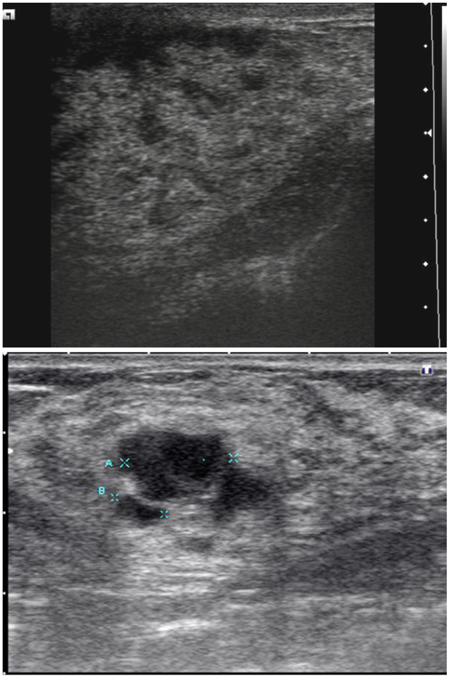

图7.5 乳腺炎。超声图像。灰度超声。

形成脓肿通常表现为疼痛减轻并在炎症区域出现波动感。乳腺脓肿在超声图像上呈现为异质结构的肿块，由无回声的坏死灶和回声强的碎屑组成，其周围精确边界呈回声假包膜（图7.6）。脓肿主要呈现为低回声或无回声结构。在CDI和PDI图像中无血流信号，常常被血流增加区域所包围。对急性乳腺炎患者进行适当的保守治疗后的随访通常显示皮肤厚度和乳腺组织结构的正常化（低回声和无回声区域数量和大小减少，反应性淋巴结消失）。在急性乳腺炎和弥漫型乳腺癌的鉴别诊断困难的情况下，应特别关注病史、临床数据、乳腺X线摄影特征和超声特征。对乳房和异常淋巴结进行细胞学或组织学检查对于判断具有重要意义。

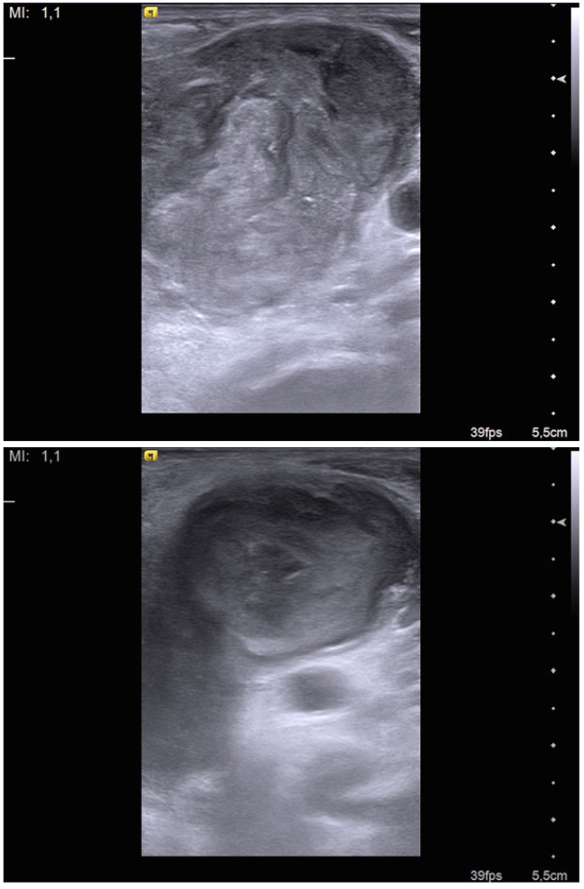

图7.6 乳腺脓肿。灰度超声图像。

在明显炎症过程中，穿刺活检通常是不可能的，在弥漫型乳腺癌中也往往没有信息价值。乳房创伤可能伴有出血和乳房血肿（图7.7）。创伤后的变化包括以下时期：急性期，头4-7天；中期，最多2周；晚期，创伤后一年及更长时间。将其分为不同时期有助于正确解读超声和临床征象。在最初的几天和几周内，超声可以检测到血肿，呈现为不规则或不规则形状的各种大小的无回声区域，通常位于表浅部位。乳房血肿需要特别关注，因为它可能是恶性肿瘤的首个征兆，考虑到新生血管生成（恶性肿瘤内的血管没有肌层，易碎且容易受损）。血肿会缓慢吸收和/或组织重塑。

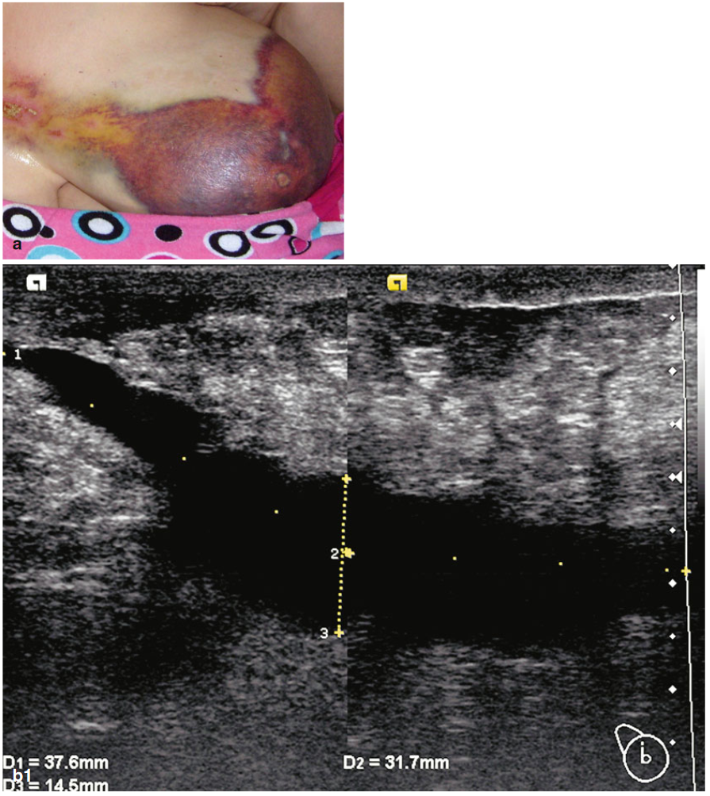

图7.7 乳房创伤性血肿，急性期。(a) 乳房视图。(b) 超声图像。灰度和PDI图像。

乳房创伤还可能引起乳腺脂肪坏死，其定义为形状不规则、边界不清或清晰的低回声或回声强的乳房区域，通常伴有后方声影。周围组织的结构往往也受到影响。此外，还会出现粗糙的钙化，其形状不规则或与病变的圆形边缘相对应。这些肿块的位置与先前的创伤或血肿的位置相对应。手术干预、炎症过程、局部缺血和其他情况也可能导致这些病变。需要将其与乳腺恶性肿瘤进行鉴别。乳房创伤或手术史以及超声和乳房X线摄影中无恶性征象提示脂肪肉芽肿的可能性。需要记住在疤痕中可能存在复发性乳腺癌的可能性。细针穿刺活检和细胞学有助于正确诊断。在大多数模糊不清的病例中，可能需要进行乳房MRI和切除活检。乳房的状况与女性激素有关。然而，被认为是病理性影响的一个重要机制是孕激素水平降低，相对或绝对雌激素水平过多。乳腺结构和功能的变化被称为纤维囊性乳房疾病（FBD）。纤维囊性乳房疾病的特征是上皮和结缔组织成分的异常比例以及各种增生和退行性乳腺变化。这种情况有许多同义词，如弥漫性囊性乳房增生、慢性囊性乳腺炎、纤维囊性乳房增生、乳腺发育异常和ReclusSchimmelbusch病。纤维囊性乳房疾病是最常见的良性乳腺疾病，影响30-63％的妇女。弥漫性乳房病变在30-50岁的妇女中观察到的频率为29.4-42.6％。在具有妇科疾病的育龄妇女中，该病变占29-95％（Portnoy等，1995）。乳腺癌发生在良性疾病中的频率比正常乳腺组织高3-5倍，特别是在具有上皮增生的结节型纤维囊性乳房疾病中（比正常乳腺组织高30-40倍）（Sinyukova等，2007）。对不同类型乳腺增生的诊断很重要，因为这些过程可能掩盖临床症状并使癌症的乳房成像复杂化。

乳腺癌的成像诊断变得复杂。该疾病的临床特征是非特异性的，并表现为一般症状，如疼痛、可触及的乳房病变和乳头分泌物。该疾病表现为导管上皮增生和结缔组织硬化，组织学上导致囊肿的形成。弥漫性纤维囊性乳房疾病的超声特征（图7.8）包括以下内容：导管不规则扩张、Cooper韧带密集、颗粒状高回声腺体组织、多个无回声囊肿、乳房实质的贫弱不对称血管模式。关于异常区域内外血管的血流变化的观点尚不一致。Smirnova（1995）和Vetshev等人（1997）报告称，纤维囊性乳房病变区域的峰值血流速度（PSV）不超过0.09 m/s（与正常值0.13-0.16 m/s相比）。非增生型纤维囊性乳房疾病的恶性风险为0.9％，而在增生明显的情况下为2-3％（Korzhenkova，2004）。超声在诊断纤维囊性乳房疾病中的敏感性为77.8％，特异性为99.5％，诊断准确性为93.2％。结节型乳房增生是乳房内存在一个或多个密集病灶的病理状态。首先，它是一个临床概念。许多疾病隐藏在结节型乳房增生的背后，如局部纤维化（45％）、囊肿（22％）、纤维腺瘤（17％）、脂肪瘤（10％）、乳腺癌、油肉芽肿和囊腺瘤样乳腺瘤（Korzhenkova，2004）。对结节型乳房增生区域的组织学检查发现腺泡增生、囊肿、纤维化、囊腔和导管腔细胞成分的增生以及其他变化。

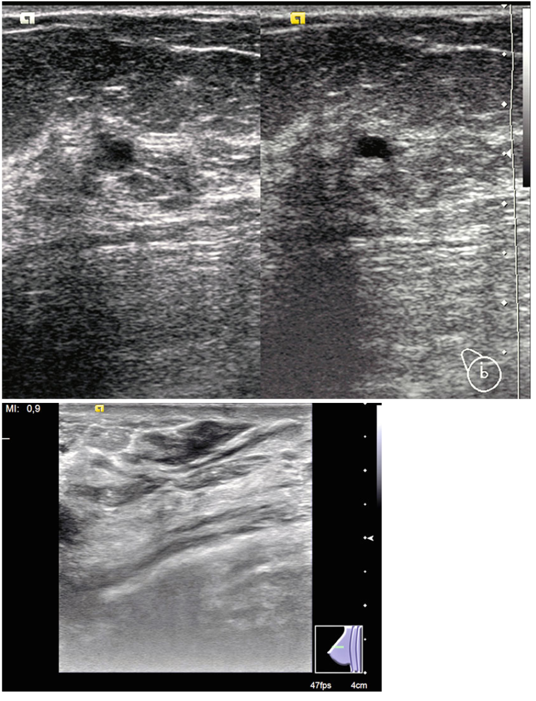

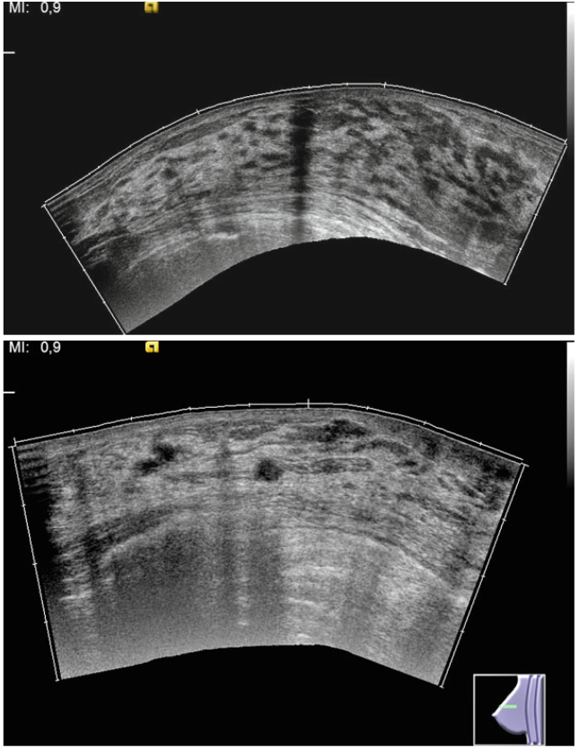

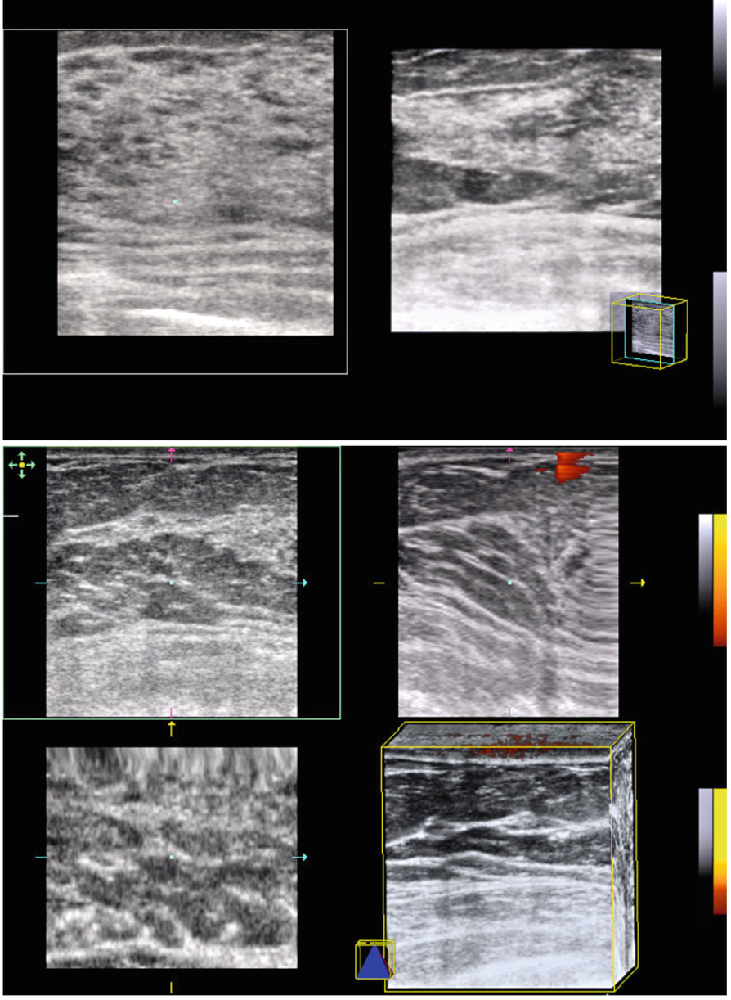

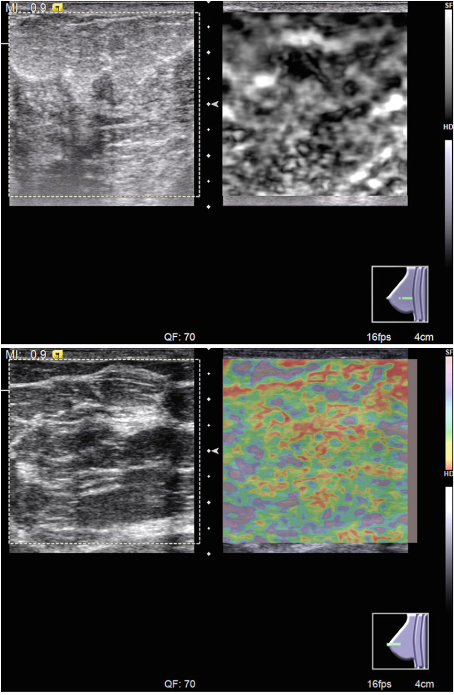

图7.8 弥漫性纤维囊性乳房疾病。超声图像。灰度、全景扫描、3D、3DPD和超声弹性成像。

上皮的非典型性被认为是癌前病变。结节型乳房增生的超声特征如下（图7.9）：单个或多个低回声区域、不同尺寸、不规则形状、模糊的边界、CDI、PDI和3DPD显示的A或低血流灌注。根据Sinyukova等人（2007）的研究，CDI在结节型乳房增生中更常显示线状血管，而不会改变其强度。平均PSV为0.16-0.50 m/s，EDV为0.07±0.04，PI为1.2±0.38，RI为0.65±0.1。结节型乳房增生的超声图像通常与乳腺癌的早期阶段无异，因此所有类型的结节性增生都应进行形态学验证。纤维囊性乳房疾病的微观基质包括乳腺的所有结构元素-腺泡、囊状转变的导管以及纤维和脂肪组织。腺泡、导管或囊肿病变可能占主导地位，但纤维组织始终以相当数量存在。在弥漫性和结节型乳房增生中，导管和导管囊肿的扩张常常是由乳腺实质过度纤维化造成的，导致局部压迫。

囊性病变是纤维囊性乳房疾病最常见的特征。囊肿的形成机制一方面涉及上皮细胞的过度分泌液体，这些细胞经历分泌式转化，另一方面涉及导管中液体吸收的紊乱。囊肿可触及，可单个或多个，具有弹性，常伴有压痛。它们可以是单个的、多发性的（更常见）、单侧的、双侧的、单纯的或复杂的。超声能够在100％的病例中精确区分囊肿，而临床上它们被定义为可触及的病变，并在乳房三角区域内以平均密度的灶状影像的形式在乳腺X线摄影中被准确地界定或与周围乳房结构融合。

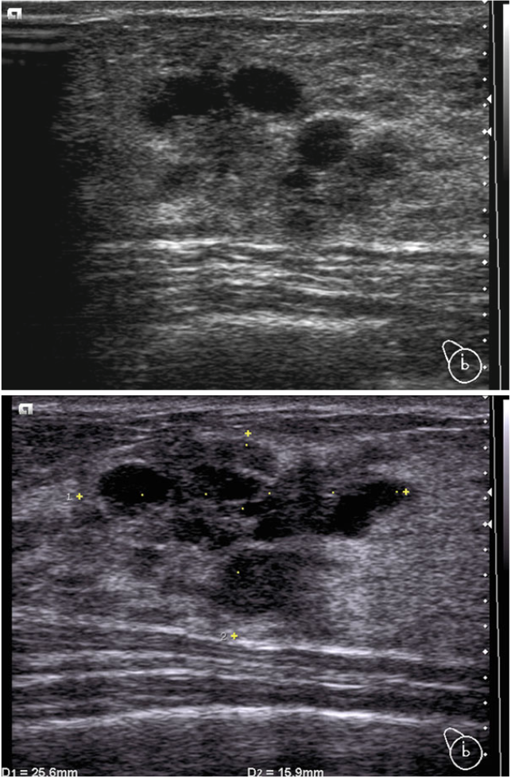

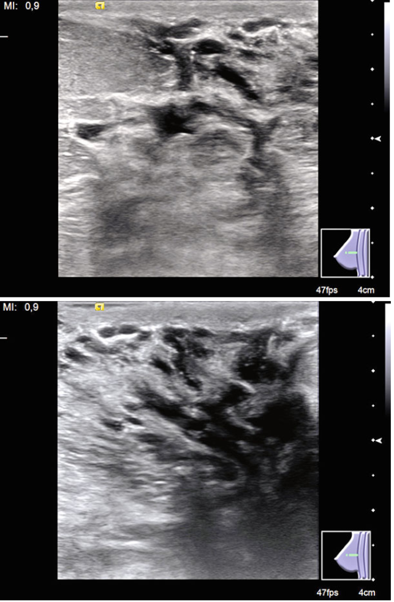

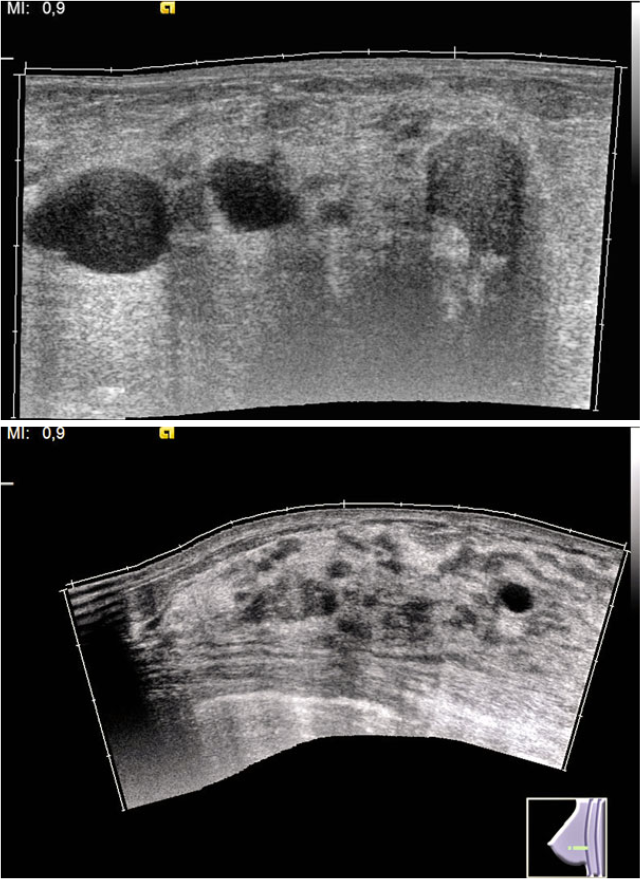

图7.9 纤维囊性乳房疾病。结节型。超声图像。灰度、PDI和全景扫描。

大多数乳腺囊肿具有以下典型的超声特征（图7.10）：

- 囊性结构
- 均质结构
- 圆形或椭圆形
- 清晰明确的边界
- 后方回声增强
- 压缩时易变形且无痛感
- CDI、PDI和3DPD显示无血流信号
- 超声弹性成像显示病变内无颜色模式

高达95％的乳腺囊肿在囊壁上没有实质性成分（Korzhenkova，2004）。这类囊肿被称为单纯（典型）和无并发症的囊肿。此外，还有乳腺微囊肿（大小为1-2毫米）、巨囊肿（单个和多房）、单个和多个囊肿（Trufanov等人，2009）。

在某些情况下，乳腺囊肿可能不表现出后方回声增强这样的特征症状。这种情况在小囊肿、被密集结构包围的囊肿、靠近胸廓的囊肿或具有明显纤维囊壁的囊肿中更常见（Zabolotskaya，2006）。在液体性乳腺病变中，有时可以观察到非典型囊肿（Sergeeva和Sotskova，2009）。它们通常与长期存在的、反复发作的囊肿以及存在炎症的囊肿有关（Zabolotskaya，2006）。

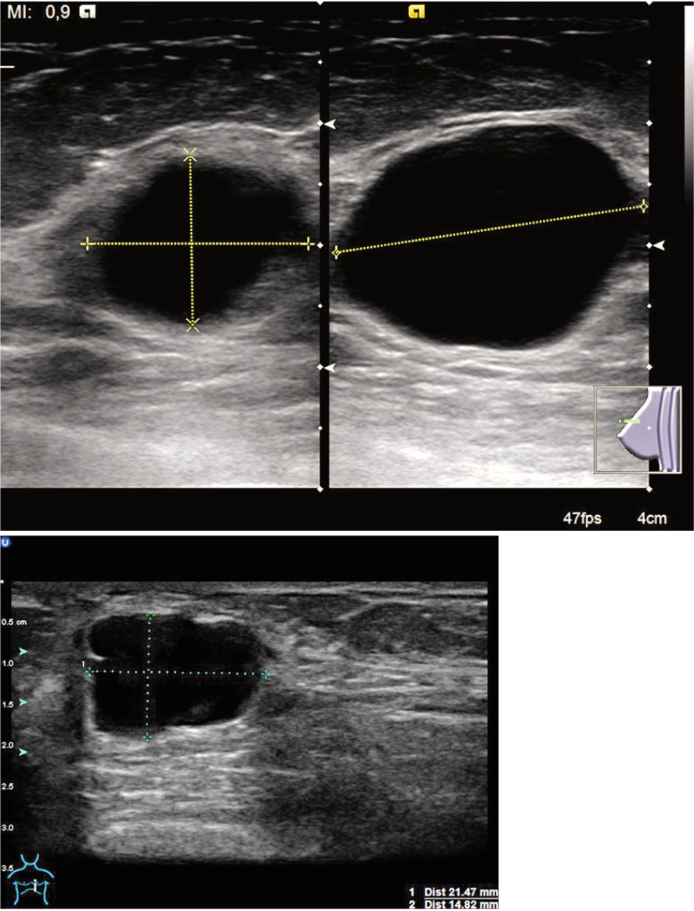

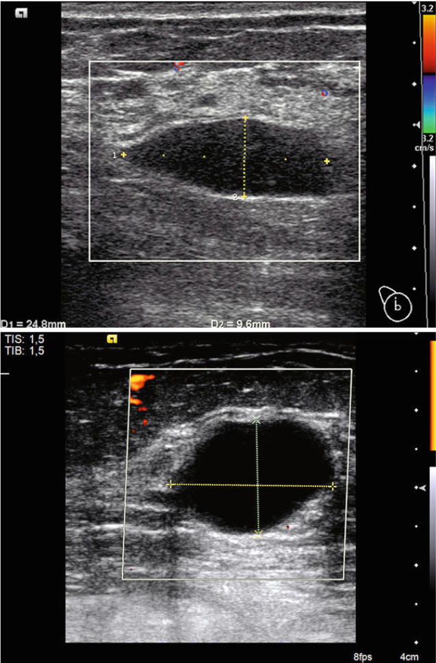

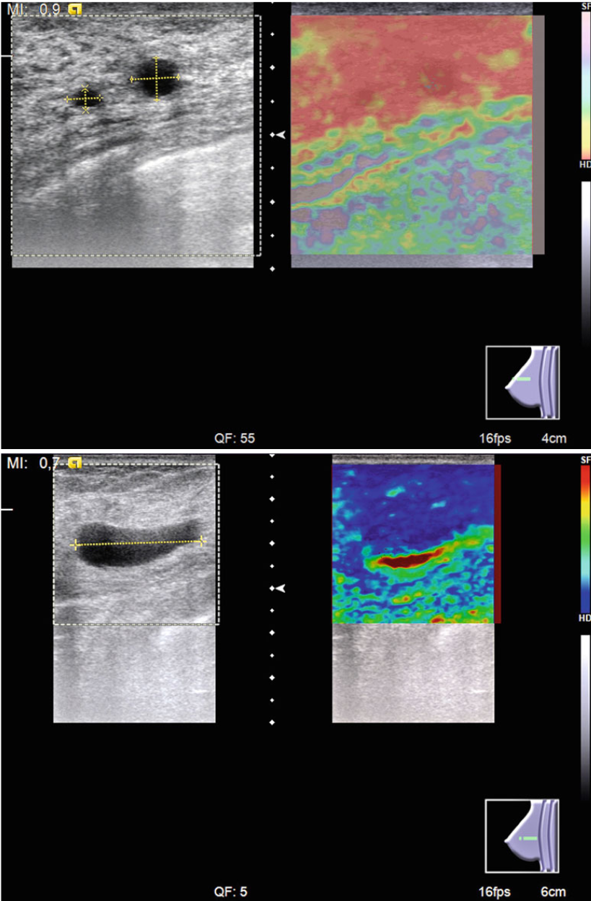

图7.10 单纯乳腺囊肿。超声图像。灰度、CDI、PDI、全景扫描、3DPD和超声弹性成像。

以下是非典型囊肿的超声特征（图7.11）：

- 囊肿壁厚
- 囊内含有结节
- 囊肿内有不同类型的实质成分
- 实质成分具有不同类型的血流灌注

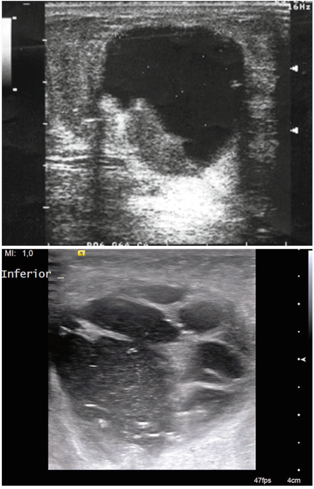

图7.11 复杂乳腺囊肿。灰度超声图像。

在最多2％的病例中，囊肿的非典型超声图像可能是源自囊肿壁的内腔生长所致（Korzhenkova，2004）。其中75％是良性的乳头状瘤。20％的囊内乳腺病变与乳头状癌相关（图7.12）。与囊肿壁相关的所有生长，特别是如果有血管化，都需要进行超声引导下的细胞学活检，并指示进行扇形切除以进行紧急组织学检查。复杂乳腺超声图像能够以95-100％的准确度轻松检测囊肿，确定其内容物、壁结构和血管性质（Shevchenko，1997；Sergeeva，2010）。

油脂囊肿是位于良性皮肤和皮下组织中的皮脂腺的潴留囊肿，它是由于皮脂腺分泌过多、导管阻塞以及油脂成分周围形成囊壁而产生的。它占所有乳腺病变的0.2％（Rozhkova，1993）。油脂囊肿在临床上表现为密度较高、轮廓清晰、无痛且与皮肤粘连的结节。油脂囊肿经常发炎和化脓。在这些情况下，可以观察到局部水肿、充血、疼痛和波动感。

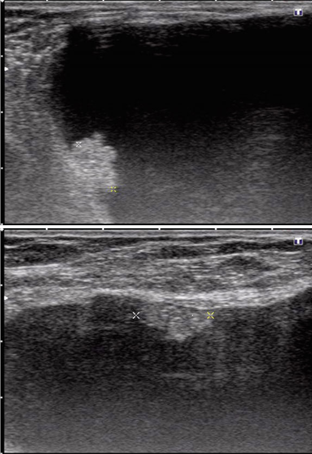

图7.12 乳腺囊腺癌。灰度超声图像。

油脂囊肿表现出以下超声特征（图7.13）：

- 低回声或无回声病变
- 与皮肤紧密相邻，皮肤层分离
- 边界清晰
- CDI、PDI和3DPD显示无血流信号
- 超声弹性成像显示无颜色模式
- 通过仔细分析获得的超声数据和评估抗菌和消炎治疗的效果，可以进行乳腺病变的复杂诊断和鉴别，常常有助于排除恶性过程。

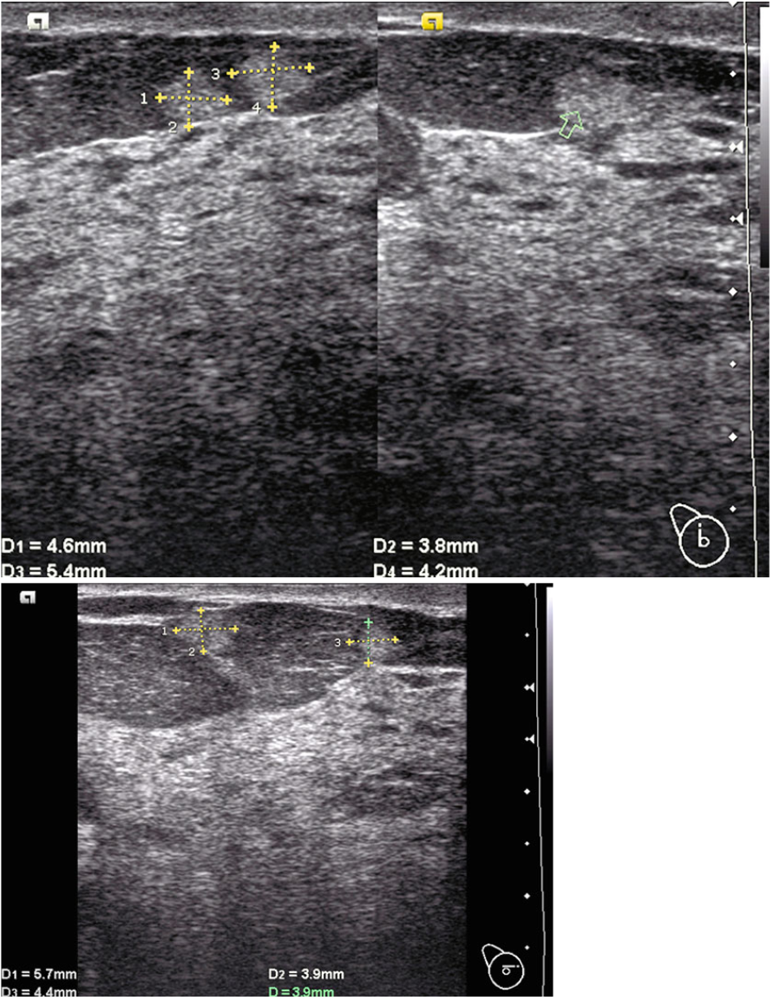

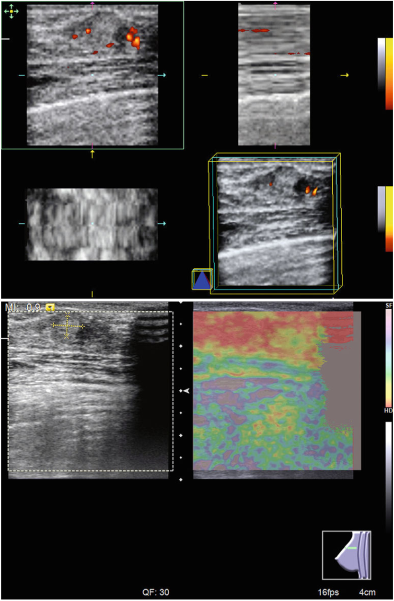

图7.13 皮脂囊肿。超声图像。灰度、3DPD和超声弹性成像。
